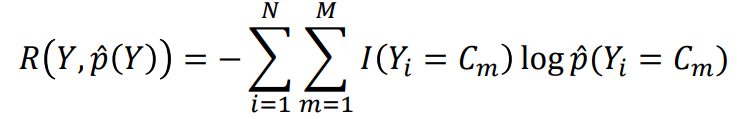
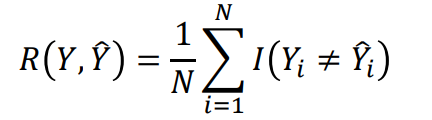

**Statement of contribution**: All members of the group assisted with the programming and the writing for the first 3 tasks of assignment 1. Then we split the tasks so Olof took assignment 1, Gustaf assignment 2, and Anton assignment 3. We assisted each other during the lab sessions with coding and problem solving. Each member has done the writing of the report on respective assignment. All results have been discussed and adjusted based on input from the group before hand in. Olof did the revision with regard to coding and writing after the first remark and have discussed the results with the group before hand in.

# **Assignment 1:**

```{r, echo=FALSE}
library(knitr)
```

```{html, echo = FALSE}
<style>
body {
text-align: justify}
</style>
```

### Step 1

-   Import the data into R and divide it into training, validation and test sets (50%/25%/25%)

```{r, echo = FALSE}
# Read the csv file
optdigits = read.csv("optdigits.csv", header = FALSE)
n=dim(optdigits)[1]

# Divide the data 50/25/25 for train, validation, and test
set.seed(12345)
id=sample(1:n, floor(n*0.5)) 
train=optdigits[id,]
id1=setdiff(1:n, id)

set.seed(12345)
id2=sample(id1, floor(n*0.25)) 
valid=optdigits[id2,]

id3=setdiff(id1,id2)
test=optdigits[id3,]

barpl = barplot(c(Train = nrow(train),Valid = nrow(valid) , Test = nrow(test)),
                main = "Sample Split",
                xlab = "Data", ylab = "Number of samples",
                col = c("Red", "Purple", "Blue"))
text(barpl,0, c(Train = nrow(train), Valid = nrow(valid), Test = nrow(test)),
     cex = 1.5, pos = 3, col = "white")
```

### Step 2

-   Use training data to fit 30-nearest neighbor classifier with function kknn() and kernel="rectangular" from package kknn and estimate .

-   Confusion matrices for the training and test data.

-   Misclassification errors for the training and test data.

-   Comment on the quality of predictions for different digits and on the overall prediction quality.

Comparing the number of faults is easiest done by the absolute predictions the algorithm gets wrong and the proportion of error compared to number of samples.

The largest number of errors are found in predicting the training data. However, this is to be expected since it has a larger sample size. **The more important point is that the rate of misclassifications is slightly higher for the testing data: 5.329154% compared to 4.500262% for training data.** These are both relatively good at predicting the outcome.

The largest difference in proportional performance for a specific outcome with regard to **misclassifications on training data is "4" with 9.14%, and on the test data is "5" is 9.709%**. The model has some variation, as both the training and test data is predicted perfectly for some outcomes in both data sets. For example, the number "0" has low misclassification rates for both data sets. The conclusion is that the model does predict certain outcomes better, such as "0", than others, such as "4" or "5". This might be because of the varying number of data points for each outcome or because of the difficulty of predicting the actual data in the bitmap.

```{r, echo = FALSE}
library(kknn)
#Training data
m1 = kknn(as.factor(V65)~., train, train, k=30, kernel = "rectangular")

Pred_train = m1$fitted.value

T_train = table(train$V65, Pred_train)
cat("The confusion matrix for the training data is: ",
    "\n")
T_train

# The rate of misclassification(s) for all outcomes
cat("\n",
    "The misclassification rate for each number is: ",
    "\n", sum(rowSums(T_train) - diag(T_train)) / sum(T_train),
    "\n")

# The rate of misclassification for each outcome
misclassr_train = 1 - (diag(T_train) / rowSums(T_train))
cat("The misclassification for all numbers is: ",
    "\n", format(misclassr_train, digits = 3))
```

```{r, echo = FALSE}
#Test data
m2 = kknn(as.factor(V65)~., train, test, k=30, kernel = "rectangular")

Pred_test = m2$fitted.value

T_test = table(test$V65, Pred_test)
cat("The confusion matrix for the test data is: ",
    "\n")
T_test

# The rate of misclassification(s) for all outcomes
cat("\n",
    "The misclassification rate for each number is: ",
    "\n", sum(rowSums(T_test) - diag(T_test)) / sum(T_test),
    "\n")

# The rate of misclassification for each outcome
misclassr_test = 1 - (diag(T_test)/ rowSums(T_test))
cat("The misclassification for all numbers is: ",
    "\n", format(misclassr_test, digits = 3))
```

```{r, echo = FALSE}
# The difference in performance on each digit
cat("The difference in missclassification for each number in rising order is: ",
    "\n", (format(misclassr_test - misclassr_train, digits = 3)))
```

### Step 3

-   Find any 2 cases of digit "8" in the training data which were easiest to classify and 3 cases that were hardest to classify.

-   Reshape features for each of these cases as matrix 8x8 and visualize the corresponding digits.

-   Comment on whether these cases seem to be hard or easy to recognize visually.

As seen in the pictures below, the first two pictures does have much more of the resemblance of the number eight. This mainly comes down to the look of having two circles on top of each other with lower pixel vales in the centers of them.

The latter three pictures do not resemble the number eight.

-   The first of which takes on more of a lambda shape, not having any circles.

-   The second to last number correlates strongly with the number 1. The difference in the picture is the clear lack of two distinct circles as well as now hollow center in the middle of the number.

-   The very last number of which much more resemble the number three. It should be noticed that the number three and eight have somewhat similar characteristics, the oversimplified difference being the the number three is made of stacked half circles. The reason for the model not predicting these numbers to be an eight is because the strong correlation with the number 3.

```{r,fig, fig.height = 3, fig.width = 3, echo = FALSE}
# Subset of the data
heatmap(as.matrix(m1$prob[950:1000,]), Colv = NA, Rowv = NA)

# High prob
p1 = matrix(as.numeric(train[964, 1:64]), ncol = 8, byrow = T)

p2 = matrix(as.numeric(train[962, 1:64]), ncol = 8, byrow = T)

#Low prob
p3 = matrix(as.numeric(train[994, 1:64]), ncol = 8, byrow = T)

p4 = matrix(as.numeric(train[987, 1:64]), ncol = 8, byrow = T)

p5 = matrix(as.numeric(train[974, 1:64]), ncol = 8, byrow = T)

# Plot results
heatmap(p1,  Colv = NA, Rowv = NA)
heatmap(p2,  Colv = NA, Rowv = NA)
heatmap(p3,  Colv = NA, Rowv = NA)
heatmap(p4,  Colv = NA, Rowv = NA)
heatmap(p5,  Colv = NA, Rowv = NA)
```

### Step 4

-   Fit a K-nearest neighbor classifiers to the training data for different values of K = 1,2, ... , 30 and plot the dependence of the training and validation misclassification errors on the value of K.

-   How does the model complexity change when K increases and how does it affect the training and validation errors?

-   Report the optimal K according to this plot.

-   Finally, estimate the test error for the model having the optimal K, compare it with the training and validation errors and make necessary conclusions about the model quality.

The best result for the validation data is found in both k = 3 and k = 4 where the lowest number of misclassifications exists. They have an error rate of 2.513089% against the validation data.

Since we want to minimize unnecessary complexity and the bias of the model, k = 4 will be the superior choice. **The missclassification rates are: 1.360544% for the training data and 2.513089% for the validation data, and 0.02507837 for the test data.**

The higher number for K means that more data points will be included in the calculation and the result and the model will be less sensitive to variation in the data - higher bias. Naturally, for very small number of k such as 1 and 2, the model will predict the training data with no misclassifications, as it only predicts the correct number according to the training data - high variance. After about k = 5, the misclassification increases approximately linearly because of the inclusion of different outcomes in the prediction. The misclassification for the validation data is 0.02722513 for low numbers of k, such as 1 and 2. It does not go 0 because of the inherent misclassification even if only considering a single data point at a time. Beyond that, it behaves like the training data for the same reason.

The models aptitude depends highly on the application of it. Presumably, a 0.02507837 misclassification rate, based of the test data, with this relatively simple model could be useful in some applications where the given misclassification rate is tolerable. A \~2.5% misclassification rate might even be considered small for interpreting numbers written by hand.

```{r, echo = FALSE}
results_train = vector(mode = "numeric", length = 30)
results_valid = vector(mode = "numeric", length = 30)

#Training data
for(i in 1:30) {
  m1 = kknn(as.factor(V65) ~ .,
            train,
            train,
            k = i,
            kernel = "rectangular")
  
  Pred1 = m1$fitted.value
  T1 = table(train$V65, Pred1)
  
  # The number of misclassifications for each outcome
  misclass1 = rowSums(T1) - diag(T1)
  
  # The number and rate of misclassification(s) for all outcomes
  results_train[i] = (sum(misclass1) / sum(T1))
}

#Validation data
for(i in 1:30) {
  m2 = kknn(as.factor(V65) ~ .,
            train,
            valid,
            k = i,
            kernel = "rectangular")
  
  Pred2 = m2$fitted.value
  T2 = table(valid$V65, Pred2)
  
  # The number of misclassifications for each outcome
  misclass2 = rowSums(T2) - diag(T2)
  
  # The number and rate of misclassification(s) for all outcomes
  results_valid[i] = (sum(misclass2) / sum(T2))
}

#results_valid[1]
#results_valid[2]

mat = matrix(c(results_train, results_valid), nrow = 30, byrow = FALSE)
matplot(mat, type = "b", pch = 1,
        main = "Training and Test misclassification based on k",
        xlab = "k", ylab = "Misclassification rate")
```

```{r, echo = FALSE}
# Test data
m1 = kknn(as.factor(V65) ~ .,
          train,
          test,
          k = 4,
          kernel = "rectangular")

Pred_test = m1$fitted.value
T_test = table(test$V65, Pred_test)

# The number of misclassifications for each outcome
misclass_test = rowSums(T_test) - diag(T_test)

cat("Training data:", "\n")
cat("k = 4:", results_train[4],"\n")

cat("Validation data:", "\n")
cat("k = 3:", results_valid[3],"\n" , "k = 4:", results_valid[4], "\n")

# The number and rate of misclassification(s) for all outcomes
cat("Test data: ",
    "\n","k = 4: ",(sum(misclass_test) / sum(T_test)))
```

### Step 5

For the cross-entropy loss function we naturally want to minimize the minus log likeleyhood.

{width="306"}

The best result is now found to be k = 6, which is close but not the same as the previous conclusion from the misclassification rate\
{width="180"}

The reason cross entropy might be more suitable to use as the error function is essentially that it is more exact. With a multinomial distribution, there could be many solutions for the model where the misclassifications are exactly the same the same for either the training or the validation data. By using cross-entropy as the error function, we can choose the best of the viable alternatives.

Another important difference is the value of the probabilities. With cross entropy, we consider the "conviction" of the model in a certain outcome. What can happen in the case of misclassification is a situation where all probabilities are low, but the model still gets the correct outcome. In this case, the model is not robust as much as it was lucky.

```{r, echo = FALSE}
CE_arr = c()

for(i in 1:30){
  m1 = kknn(as.factor(V65) ~ .,
            train,
            valid,
            k = i,
            kernel = "rectangular")
  
  probs = m1$prob
  CE = 0
  
  for (j in 1:nrow(valid)) {
    # The cross entropy loss function can be implemented as
    # The +1 comes is for identifying the correct column
    # since r counts from 1,2,3,...
    CE = (CE - (log((probs[j, valid[j,65]+1]) + 1e-15)))
  }
  CE_arr = c(CE_arr, CE)
}

plot(CE_arr, col = "red", type = "b", main = "Cross entropy depending on k",
     xlab = "k", ylab = "Cross entropy")
cat("The best k is: ", which.min(CE_arr), "with a value of ",
    CE_arr[which.min(CE_arr)])
```

**Appendix 1**

```{r, ref.label=knitr::all_labels(),echo=TRUE,eval=FALSE}
```
